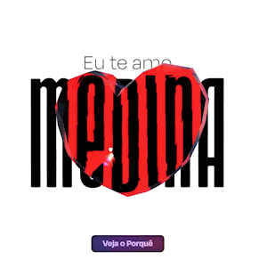

<p align="center">
  <picture>
    
  </picture>
</p>

## 📚 About

The **medina** project is a unique and interactive website created for a very special purpose: a girlfriend proposal. The site was designed to be a creative experience, almost like a game, combining 3D art with intuitive and engaging navigation.

The experience features various mouse interactions, encouraging the user to explore the environment and the animations that lead them to the big final question. It was an extremely rewarding personal project that allowed me to dive into the world of web development with **3D**, improving my skills in **UX (User Experience)** and learning to create models and animations from scratch with **Blender**.

And the best part? It worked! She said yes, and the site was a success. If you want to check out the full experience, you can access the deployed link below.

## 🚀 Features

### Content & Interactions

- **Interactive Experience:** A website with navigation and interactions that reveal a personal story.
- **Intuitive Controls:** Mouse interactions that allow you to drag and rotate 3D objects, as well as interact with magnetic and anti-magnetic buttons.
- **Visual Narrative:** A sequence of photos with personalized texts that appear as the user progresses through the journey.

### 3D Modeling & Animations

- **3D Envelope Model:** An envelope model with `float`, `hover`, and `click` animations, revealing the content inside.
- **3D Heart Model:** An animated heart model with a glass texture that the user can drag and rotate.
- **Transitions and Effects:** In and out animations, camera parallax effects to create depth, and smooth transitions between stages.

## 🛠 Built With

<p align="left">
  
</p>

- **Framework:** Next.js
- **3D Rendering:** Three.js
- **Language:** TypeScript
- **3D Modeling:** Blender
- **Deploy:** Vercel

### Change to "How to Run" Instructions

I have updated the instructions for running the application to use `npm run start` instead of `start`. The revised section is below.

-----

### 👨‍💻 How to Run

The project has a modular code structure with well-defined components and hooks, making it easy to maintain and understand.

1.  **Clone the repository:**

    ```bash
    git clone https://github.com/dancpluz/medina.git
    ```

2.  **Navigate to the project directory:**

    ```bash
    cd medina
    ```

3.  **Install dependencies:**

    ```bash
    npm install
    ```

4.  **Start the production server:**

    ```bash
    npm run start
    ```

5.  **Access the application in your browser:**

    The application will be accessible at **http://localhost:3000** after the server starts.

### 🌍 Deployment

The project is available online at the following link:

[medina-theta.vercel.app](https://medina-theta.vercel.app/)

## 👥 Group / Author(s)

This project was developed by:

- **Daniel Luz** — [GitHub](https://github.com/dancpluz)

## 🤝 Contributions / Acknowledgements

This was a personal project and a gift. The biggest thanks goes to the inspiration behind it all, who made the development journey full of joy.

## 📄 License

<a href="https://opensource.org/licenses/MIT"></a>

This project is licensed under the **MIT License**.

## ⚠ Status / WIP

The project is complete for its main purpose.

<details>
  <summary>Click to view task list and backlog</summary>

- [x] **3D Envelope Model**
  - [x] Model
  - [x] Float animation
  - [x] Hover animation
  - [x] Click animation
- [x] **3D Heart Model**
  - [x] Model
  - [x] Entry animation
  - [x] Exit animation
  - [x] Click animation
  - [x] Drag to rotate
  - [x] Glass texture
- [x] **Text & Content**
  - [x] Back text (name)
  - [x] Front button (see why)
- [x] **Photos**
  - [x] Choose photos
  - [x] Choose texts
  - [x] Photo interaction
  - [x] Each photo with its own text
  - [x] Click to zoom
  - [x] Hover animation
  - [x] Photo sequence rotating with the heart
- [x] **Proposal**
  - [x] Anti-magnetic button
  - [x] Magnetic button
- [x] **Other Interactions**
  - [x] Reverse magnetic button
- [x] **Design & UX**
  - [x] Find font
  - [x] Responsive
  - [x] Final joke
  - [x] Camera Parallax effect
  - [x] Improve Loading state
  - [x] Context
  - [x] Animation stages
  - [x] Forward button
  - [x] Button transitions
  - [x] Organize Code

### Backlog

- [ ] Custom music with a spinning record.
- [ ] Sound effects.
- [ ] Animated background.
</details>
